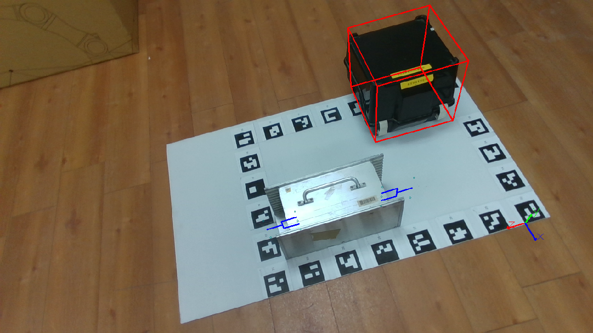
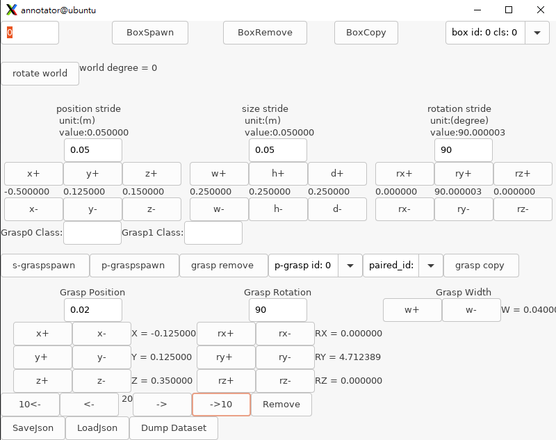

# GraspGeneration labeling tool: 6DOF_LABEL_TOOL

This project provides a labeling tool for research on 6-DoF pose estimation and grasp generation based on keypoint estimation. For a project that uses this labeling tool, please refer to the following link:
https://github.com/s095339/GraspGeneration

| | |
|-|-|

## Enviroment
1.  Ubuntu 22.04 
2.  opencv 4.7.0
3.  cmake 3.29

## installation

wxWidgets is used to build the GUI interface for annotation. To install the wxWidgets, run this command:

>sudo apt-get install libwxgtk3.0-gtk3-dev

To install Opencv 4.7.0, refer to the following link:

https://www.samontab.com/web/2023/02/installing-opencv-4-7-0-in-ubuntu-22-04-lts/

how to use wxWidgets on Cmake:
https://docs.wxwidgets.org/latest/overview_cmake.html

## Data preparation
The sample dataset is provided by following link:
https://drive.google.com/drive/folders/1yYS3XwtdVb95rRmZc94Bi462mfUMRn7D?usp=drive_link

In the dataset, color images are stored in the /color directory, and depth images are stored in the /depth directory. Each color image and its corresponding depth image captured from the same perspective share the same filename.

This project recovers the extrinsic parameters based on the ArUco markers visible in each image. Please place at least four ArUco markers in the environment before collecting images. Use these markers to define the world coordinate system. The information about the world coordinates, ArUco markers, and camera intrinsics should be stored in world_camera_setting.json.
